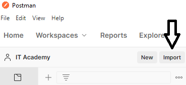

# Node Initial Project

### Project Structure

Main structure of node.js project. Folders / files:

- <b>postmanTests</b>. Tests folder
- <b>src</b>:
    - <b>database</b>
      - <b>checkDB.js</b>
      - <b>db.js</b>
    - <b>models</b>
      - <b>associations.js</b>
      - <b>Game.js</b>
      - <b>Player.js</b>
    - <b>routes</b>
      - <b>players.js</b>
    - <b>app.js</b>. Entry point.
- <b>.gitignore</b>
- <b>.ecosystem.config.js</b>. Process Manage at runtime. 
- <b>package.json</b>.

### Import project for use with Visual Studio Code

Follow the steps below:
* Clone the project from the Github Platform. Execute:
  ```
  git clone [url project]
  ```

### How to run the project:

1. Install all `node_modules`:
  ```
  npm install
  ```
2. Be sure you have installed MySQL and set your MySQL username & password to the file `ecosystem.config.js`:
  
3. Run the command line to check the database `dices` exists:
  ```
  npm run dbCheck
  ```
4. Run the command line to init the project:
  ```
  npm run dev
  ```
5. Be sure you have installed Postman for http requests. Import the http requests from the file: `postmanTest`:
  
6. Now you are able to make http requests by Postman
  
